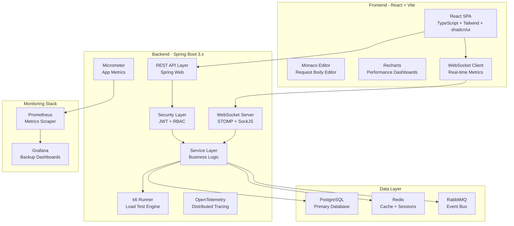
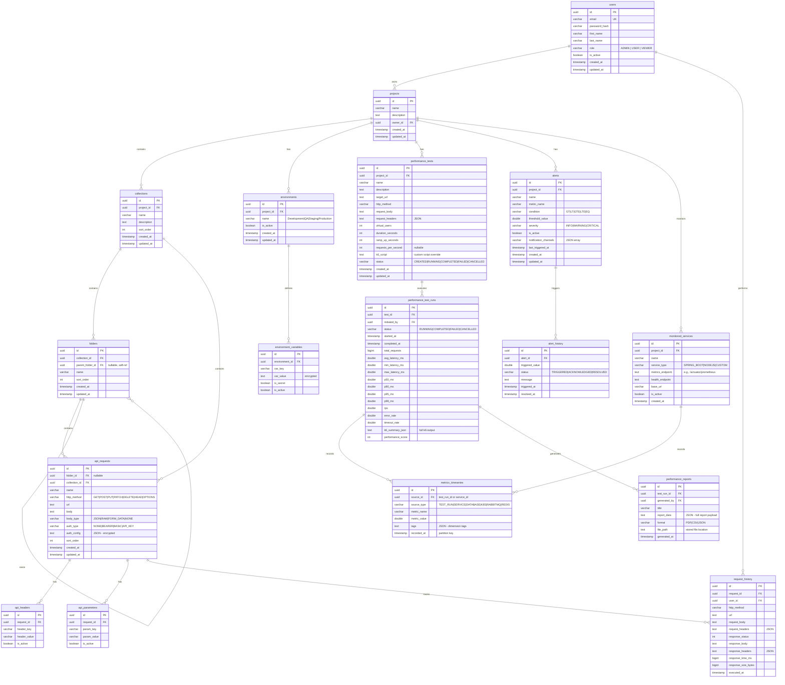

# API Performance Observatory — Implementation Plan

A modern Postman alternative combined with performance testing, load testing, and infrastructure observability platform.

**Project Location**: `D:\new projects 2026\api-performance-check`

---

## User Review Required

> [!IMPORTANT]
> **Database Choice**: The plan uses PostgreSQL as specified. For high-frequency time-series metrics, the design uses a partitioned `metrics_timeseries` table with retention policies that can later migrate to TimescaleDB with minimal changes. Please confirm this approach vs. starting with TimescaleDB from day one.

> [!IMPORTANT]
> **Authentication Provider**: The plan uses custom JWT authentication with Spring Security. Would you prefer to integrate with an external identity provider (Keycloak, Auth0) instead, or is custom JWT sufficient for the initial implementation?

> [!WARNING]
> **k6 Integration**: k6 will be invoked as a subprocess via `ProcessBuilder`. This requires k6 to be installed on the backend server or available in the Docker image. The Docker image will include k6 pre-installed. Confirm this approach is acceptable.

> [!IMPORTANT]
> **Build Tool**: The plan uses **Maven** for the Spring Boot backend. Let me know if you prefer **Gradle** instead.

---

## Open Questions

1. **Email Provider**: For alert notifications via email, should we integrate with a specific SMTP provider (SendGrid, AWS SES) or use a generic SMTP configuration?
2. **AI Analyzer**: The AI Performance Analyzer (Phase 9) — should it use a local rule engine only, or integrate with an LLM API (OpenAI/Gemini) for natural language recommendations?
3. **Multi-tenancy**: Should the application support multi-tenant isolation (each user sees only their projects), or is it a single-team shared instance?

---

## High-Level Architecture



---

## Database ER Diagram



---

## Backend Package Structure

```
D:\new projects 2026\api-performance-check\
├── backend/
│   ├── pom.xml
│   ├── Dockerfile
│   └── src/
│       ├── main/
│       │   ├── java/com/observatory/api/
│       │   │   ├── ApiPerformanceObservatoryApplication.java
│       │   │   │
│       │   │   ├── shared/                          # Cross-cutting concerns
│       │   │   │   ├── domain/
│       │   │   │   │   ├── BaseEntity.java          # @MappedSuperclass with audit fields
│       │   │   │   │   └── ApiResponse.java         # Standard API response wrapper
│       │   │   │   ├── exception/
│       │   │   │   │   ├── GlobalExceptionHandler.java
│       │   │   │   │   ├── ResourceNotFoundException.java
│       │   │   │   │   ├── UnauthorizedException.java
│       │   │   │   │   └── ValidationException.java
│       │   │   │   ├── config/
│       │   │   │   │   ├── JpaAuditConfig.java
│       │   │   │   │   ├── CorsConfig.java
│       │   │   │   │   ├── WebSocketConfig.java
│       │   │   │   │   ├── RedisConfig.java
│       │   │   │   │   ├── RabbitMqConfig.java
│       │   │   │   │   ├── OpenApiConfig.java
│       │   │   │   │   └── AsyncConfig.java
│       │   │   │   └── util/
│       │   │   │       ├── JsonUtils.java
│       │   │   │       └── EncryptionUtils.java
│       │   │   │
│       │   │   ├── auth/                            # Authentication module
│       │   │   │   ├── controller/
│       │   │   │   │   └── AuthController.java
│       │   │   │   ├── service/
│       │   │   │   │   ├── AuthService.java
│       │   │   │   │   ├── JwtService.java
│       │   │   │   │   └── CustomUserDetailsService.java
│       │   │   │   ├── dto/
│       │   │   │   │   ├── LoginRequest.java
│       │   │   │   │   ├── RegisterRequest.java
│       │   │   │   │   ├── AuthResponse.java
│       │   │   │   │   └── RefreshTokenRequest.java
│       │   │   │   ├── entity/
│       │   │   │   │   ├── User.java
│       │   │   │   │   └── RefreshToken.java
│       │   │   │   ├── repository/
│       │   │   │   │   ├── UserRepository.java
│       │   │   │   │   └── RefreshTokenRepository.java
│       │   │   │   ├── security/
│       │   │   │   │   ├── SecurityConfig.java
│       │   │   │   │   ├── JwtAuthenticationFilter.java
│       │   │   │   │   ├── JwtAuthEntryPoint.java
│       │   │   │   │   └── WebSocketAuthInterceptor.java
│       │   │   │   └── mapper/
│       │   │   │       └── UserMapper.java
│       │   │   │
│       │   │   ├── project/                         # Projects & Collections module
│       │   │   │   ├── controller/
│       │   │   │   │   ├── ProjectController.java
│       │   │   │   │   ├── CollectionController.java
│       │   │   │   │   └── FolderController.java
│       │   │   │   ├── service/
│       │   │   │   │   ├── ProjectService.java
│       │   │   │   │   ├── CollectionService.java
│       │   │   │   │   └── FolderService.java
│       │   │   │   ├── dto/
│       │   │   │   │   ├── ProjectRequest.java
│       │   │   │   │   ├── ProjectResponse.java
│       │   │   │   │   ├── CollectionRequest.java
│       │   │   │   │   ├── CollectionResponse.java
│       │   │   │   │   ├── FolderRequest.java
│       │   │   │   │   └── FolderResponse.java
│       │   │   │   ├── entity/
│       │   │   │   │   ├── Project.java
│       │   │   │   │   ├── Collection.java
│       │   │   │   │   └── Folder.java
│       │   │   │   ├── repository/
│       │   │   │   │   ├── ProjectRepository.java
│       │   │   │   │   ├── CollectionRepository.java
│       │   │   │   │   └── FolderRepository.java
│       │   │   │   └── mapper/
│       │   │   │       ├── ProjectMapper.java
│       │   │   │       ├── CollectionMapper.java
│       │   │   │       └── FolderMapper.java
│       │   │   │
│       │   │   ├── apiclient/                       # API Client module
│       │   │   │   ├── controller/
│       │   │   │   │   ├── ApiRequestController.java
│       │   │   │   │   └── RequestExecutionController.java
│       │   │   │   ├── service/
│       │   │   │   │   ├── ApiRequestService.java
│       │   │   │   │   ├── RequestExecutionService.java
│       │   │   │   │   └── RequestHistoryService.java
│       │   │   │   ├── dto/
│       │   │   │   │   ├── ApiRequestDto.java
│       │   │   │   │   ├── ExecuteRequestDto.java
│       │   │   │   │   ├── ExecutionResultDto.java
│       │   │   │   │   └── RequestHistoryDto.java
│       │   │   │   ├── entity/
│       │   │   │   │   ├── ApiRequest.java
│       │   │   │   │   ├── ApiHeader.java
│       │   │   │   │   ├── ApiParameter.java
│       │   │   │   │   └── RequestHistory.java
│       │   │   │   ├── repository/
│       │   │   │   │   ├── ApiRequestRepository.java
│       │   │   │   │   ├── ApiHeaderRepository.java
│       │   │   │   │   ├── ApiParameterRepository.java
│       │   │   │   │   └── RequestHistoryRepository.java
│       │   │   │   └── mapper/
│       │   │   │       └── ApiRequestMapper.java
│       │   │   │
│       │   │   ├── environment/                     # Environment Variables module
│       │   │   │   ├── controller/
│       │   │   │   │   └── EnvironmentController.java
│       │   │   │   ├── service/
│       │   │   │   │   ├── EnvironmentService.java
│       │   │   │   │   └── VariableResolverService.java
│       │   │   │   ├── dto/
│       │   │   │   │   ├── EnvironmentDto.java
│       │   │   │   │   └── EnvironmentVariableDto.java
│       │   │   │   ├── entity/
│       │   │   │   │   ├── Environment.java
│       │   │   │   │   └── EnvironmentVariable.java
│       │   │   │   ├── repository/
│       │   │   │   │   ├── EnvironmentRepository.java
│       │   │   │   │   └── EnvironmentVariableRepository.java
│       │   │   │   └── mapper/
│       │   │   │       └── EnvironmentMapper.java
│       │   │   │
│       │   │   ├── swagger/                         # Swagger/OpenAPI Import module
│       │   │   │   ├── controller/
│       │   │   │   │   └── SwaggerImportController.java
│       │   │   │   ├── service/
│       │   │   │   │   ├── SwaggerParserService.java
│       │   │   │   │   └── SwaggerImportService.java
│       │   │   │   └── dto/
│       │   │   │       ├── SwaggerImportRequest.java
│       │   │   │       └── SwaggerImportResult.java
│       │   │   │
│       │   │   ├── performance/                     # Performance Testing module
│       │   │   │   ├── controller/
│       │   │   │   │   ├── PerformanceTestController.java
│       │   │   │   │   └── TestComparisonController.java
│       │   │   │   ├── service/
│       │   │   │   │   ├── PerformanceTestService.java
│       │   │   │   │   ├── K6RunnerService.java
│       │   │   │   │   ├── TestComparisonService.java
│       │   │   │   │   └── PerformanceScoreService.java
│       │   │   │   ├── dto/
│       │   │   │   │   ├── PerformanceTestDto.java
│       │   │   │   │   ├── TestRunDto.java
│       │   │   │   │   ├── TestComparisonDto.java
│       │   │   │   │   └── PerformanceScoreDto.java
│       │   │   │   ├── entity/
│       │   │   │   │   ├── PerformanceTest.java
│       │   │   │   │   └── PerformanceTestRun.java
│       │   │   │   ├── repository/
│       │   │   │   │   ├── PerformanceTestRepository.java
│       │   │   │   │   └── PerformanceTestRunRepository.java
│       │   │   │   └── mapper/
│       │   │   │       └── PerformanceTestMapper.java
│       │   │   │
│       │   │   ├── monitoring/                      # Infrastructure Monitoring module
│       │   │   │   ├── controller/
│       │   │   │   │   ├── ServiceMonitorController.java
│       │   │   │   │   ├── DatabaseMonitorController.java
│       │   │   │   │   ├── KubernetesMonitorController.java
│       │   │   │   │   ├── RabbitMqMonitorController.java
│       │   │   │   │   └── RedisMonitorController.java
│       │   │   │   ├── service/
│       │   │   │   │   ├── ServiceMetricsCollector.java
│       │   │   │   │   ├── DatabaseMetricsCollector.java
│       │   │   │   │   ├── KubernetesMetricsCollector.java
│       │   │   │   │   ├── RabbitMqMetricsCollector.java
│       │   │   │   │   ├── RedisMetricsCollector.java
│       │   │   │   │   └── MetricsAggregationService.java
│       │   │   │   ├── dto/
│       │   │   │   │   ├── ServiceMetricsDto.java
│       │   │   │   │   ├── DatabaseMetricsDto.java
│       │   │   │   │   ├── JvmMetricsDto.java
│       │   │   │   │   ├── KubernetesMetricsDto.java
│       │   │   │   │   ├── RabbitMqMetricsDto.java
│       │   │   │   │   └── RedisMetricsDto.java
│       │   │   │   └── entity/
│       │   │   │       └── MonitoredService.java
│       │   │   │
│       │   │   ├── metrics/                         # Metrics Time-series module
│       │   │   │   ├── service/
│       │   │   │   │   ├── MetricsIngestionService.java
│       │   │   │   │   ├── MetricsQueryService.java
│       │   │   │   │   └── MetricsRetentionService.java
│       │   │   │   ├── entity/
│       │   │   │   │   └── MetricTimeseries.java
│       │   │   │   └── repository/
│       │   │   │       └── MetricTimeseriesRepository.java
│       │   │   │
│       │   │   ├── alerting/                        # Alerting module
│       │   │   │   ├── controller/
│       │   │   │   │   └── AlertController.java
│       │   │   │   ├── service/
│       │   │   │   │   ├── AlertService.java
│       │   │   │   │   ├── AlertEvaluationService.java
│       │   │   │   │   └── notification/
│       │   │   │   │       ├── NotificationService.java
│       │   │   │   │       ├── InAppNotificationService.java
│       │   │   │   │       └── EmailNotificationService.java
│       │   │   │   ├── dto/
│       │   │   │   │   ├── AlertDto.java
│       │   │   │   │   └── AlertHistoryDto.java
│       │   │   │   ├── entity/
│       │   │   │   │   ├── Alert.java
│       │   │   │   │   └── AlertHistory.java
│       │   │   │   └── repository/
│       │   │   │       ├── AlertRepository.java
│       │   │   │       └── AlertHistoryRepository.java
│       │   │   │
│       │   │   ├── reporting/                       # Reporting module
│       │   │   │   ├── controller/
│       │   │   │   │   └── ReportController.java
│       │   │   │   ├── service/
│       │   │   │   │   ├── ReportGenerationService.java
│       │   │   │   │   ├── PdfReportService.java
│       │   │   │   │   └── CsvExportService.java
│       │   │   │   ├── dto/
│       │   │   │   │   └── ReportDto.java
│       │   │   │   ├── entity/
│       │   │   │   │   └── PerformanceReport.java
│       │   │   │   └── repository/
│       │   │   │       └── PerformanceReportRepository.java
│       │   │   │
│       │   │   ├── analysis/                        # AI/Bottleneck Analysis module
│       │   │   │   ├── controller/
│       │   │   │   │   └── AnalysisController.java
│       │   │   │   ├── service/
│       │   │   │   │   ├── BottleneckDetectorService.java
│       │   │   │   │   ├── PerformanceAnalyzerService.java
│       │   │   │   │   └── RecommendationEngine.java
│       │   │   │   └── dto/
│       │   │   │       ├── BottleneckDto.java
│       │   │   │       ├── AnalysisResultDto.java
│       │   │   │       └── RecommendationDto.java
│       │   │   │
│       │   │   └── websocket/                       # WebSocket broadcasting
│       │   │       ├── controller/
│       │   │       │   └── MetricsWebSocketController.java
│       │   │       └── service/
│       │   │           └── MetricsBroadcastService.java
│       │   │
│       │   └── resources/
│       │       ├── application.yml
│       │       ├── application-dev.yml
│       │       ├── application-prod.yml
│       │       └── db/
│       │           └── migration/
│       │               ├── V1__init_users_and_auth.sql
│       │               ├── V2__create_projects_collections.sql
│       │               ├── V3__create_api_requests.sql
│       │               ├── V4__create_environments.sql
│       │               ├── V5__create_performance_tests.sql
│       │               ├── V6__create_metrics_timeseries.sql
│       │               ├── V7__create_alerts.sql
│       │               ├── V8__create_monitoring.sql
│       │               └── V9__create_reports.sql
│       │
│       └── test/java/com/observatory/api/
│           ├── auth/
│           ├── project/
│           ├── apiclient/
│           └── performance/
```

---

## Frontend Folder Structure

```
D:\new projects 2026\api-performance-check\
├── frontend/
│   ├── package.json
│   ├── vite.config.ts
│   ├── tsconfig.json
│   ├── tsconfig.app.json
│   ├── tsconfig.node.json
│   ├── components.json                   # shadcn/ui config
│   ├── Dockerfile
│   │
│   └── src/
│       ├── main.tsx
│       │
│       ├── app/                           # App bootstrap
│       │   ├── App.tsx
│       │   ├── providers.tsx              # QueryClient, Theme, Toast
│       │   └── routes.tsx                 # React Router config
│       │
│       ├── assets/                        # Static assets
│       │   └── logo.svg
│       │
│       ├── components/                    # Shared UI components
│       │   ├── ui/                        # shadcn/ui primitives (CLI-generated)
│       │   │   ├── button.tsx
│       │   │   ├── card.tsx
│       │   │   ├── dialog.tsx
│       │   │   ├── dropdown-menu.tsx
│       │   │   ├── input.tsx
│       │   │   ├── select.tsx
│       │   │   ├── sidebar.tsx
│       │   │   ├── table.tsx
│       │   │   ├── tabs.tsx
│       │   │   ├── badge.tsx
│       │   │   ├── skeleton.tsx
│       │   │   ├── tooltip.tsx
│       │   │   ├── sonner.tsx
│       │   │   └── ...
│       │   ├── navigation/
│       │   │   ├── AppSidebar.tsx          # Main nav sidebar
│       │   │   ├── AppHeader.tsx           # Top bar with project/env selector
│       │   │   └── UserDropdown.tsx
│       │   ├── feedback/
│       │   │   ├── ErrorBoundary.tsx
│       │   │   ├── PageLoader.tsx
│       │   │   └── EmptyState.tsx
│       │   └── data-display/
│       │       ├── KpiCard.tsx             # Metric card with trend indicator
│       │       ├── DataTable.tsx           # Reusable paginated table
│       │       └── StatusBadge.tsx
│       │
│       ├── config/
│       │   ├── env.ts                     # Type-safe environment config
│       │   └── site.ts                    # App metadata
│       │
│       ├── features/                      # Domain-sliced modules
│       │   ├── auth/
│       │   │   ├── api/auth-service.ts
│       │   │   ├── components/LoginForm.tsx
│       │   │   ├── pages/LoginPage.tsx
│       │   │   └── stores/useAuthStore.ts
│       │   │
│       │   ├── projects/
│       │   │   ├── api/projects-service.ts
│       │   │   ├── components/
│       │   │   │   ├── ProjectCard.tsx
│       │   │   │   ├── ProjectCreateDialog.tsx
│       │   │   │   └── CollectionTree.tsx
│       │   │   └── pages/
│       │   │       ├── ProjectsPage.tsx
│       │   │       └── ProjectDetailPage.tsx
│       │   │
│       │   ├── api-client/
│       │   │   ├── api/request-service.ts
│       │   │   ├── components/
│       │   │   │   ├── RequestBuilder.tsx       # URL bar + method selector
│       │   │   │   ├── RequestTabs.tsx          # Params, Headers, Auth, Body tabs
│       │   │   │   ├── BodyEditor.tsx           # Monaco-based JSON editor
│       │   │   │   ├── ResponseViewer.tsx       # Response body + headers + timing
│       │   │   │   ├── AuthConfigPanel.tsx      # Bearer/Basic/API Key
│       │   │   │   ├── HeadersEditor.tsx        # Key-value header editor
│       │   │   │   └── ParamsEditor.tsx         # Query parameter editor
│       │   │   ├── hooks/
│       │   │   │   └── useRequestExecution.ts
│       │   │   └── pages/
│       │   │       └── ApiClientPage.tsx
│       │   │
│       │   ├── environments/
│       │   │   ├── api/environment-service.ts
│       │   │   ├── components/
│       │   │   │   ├── EnvironmentSelector.tsx
│       │   │   │   └── VariablesEditor.tsx
│       │   │   └── pages/
│       │   │       └── EnvironmentsPage.tsx
│       │   │
│       │   ├── swagger/
│       │   │   ├── api/swagger-service.ts
│       │   │   ├── components/
│       │   │   │   ├── SwaggerImportForm.tsx
│       │   │   │   └── ApiTreeView.tsx
│       │   │   └── pages/
│       │   │       └── SwaggerImportPage.tsx
│       │   │
│       │   ├── performance/
│       │   │   ├── api/performance-service.ts
│       │   │   ├── components/
│       │   │   │   ├── TestConfigForm.tsx
│       │   │   │   ├── LiveTestMonitor.tsx      # Real-time test execution view
│       │   │   │   ├── TestRunCard.tsx
│       │   │   │   ├── TestComparisonTable.tsx
│       │   │   │   ├── PerformanceScoreGauge.tsx
│       │   │   │   └── PercentileChart.tsx
│       │   │   ├── hooks/
│       │   │   │   └── useTestStream.ts
│       │   │   └── pages/
│       │   │       ├── PerformanceTestsPage.tsx
│       │   │       ├── LiveTestPage.tsx
│       │   │       ├── TestHistoryPage.tsx
│       │   │       └── TestComparisonPage.tsx
│       │   │
│       │   ├── dashboard/
│       │   │   ├── api/dashboard-service.ts
│       │   │   ├── components/
│       │   │   │   ├── KpiRow.tsx
│       │   │   │   ├── ResponseTimeChart.tsx
│       │   │   │   ├── ThroughputChart.tsx
│       │   │   │   ├── ErrorRateChart.tsx
│       │   │   │   └── InfrastructurePanel.tsx
│       │   │   └── pages/
│       │   │       └── DashboardPage.tsx
│       │   │
│       │   ├── monitoring/
│       │   │   ├── api/monitoring-service.ts
│       │   │   ├── components/
│       │   │   │   ├── CpuMemoryChart.tsx
│       │   │   │   ├── JvmHeapChart.tsx
│       │   │   │   ├── GcPauseChart.tsx
│       │   │   │   ├── ThreadPoolChart.tsx
│       │   │   │   ├── DbConnectionPoolChart.tsx
│       │   │   │   ├── SlowQueryTable.tsx
│       │   │   │   ├── KubernetesPodTable.tsx
│       │   │   │   ├── RabbitMqQueueChart.tsx
│       │   │   │   ├── RedisCacheChart.tsx
│       │   │   │   └── DependencyGraph.tsx
│       │   │   ├── hooks/
│       │   │   │   └── useMetricsStream.ts
│       │   │   └── pages/
│       │   │       ├── ServiceMonitoringPage.tsx
│       │   │       ├── DatabaseMonitoringPage.tsx
│       │   │       ├── JvmMonitoringPage.tsx
│       │   │       ├── KubernetesMonitoringPage.tsx
│       │   │       └── RabbitMqMonitoringPage.tsx
│       │   │
│       │   ├── alerts/
│       │   │   ├── api/alerts-service.ts
│       │   │   ├── components/
│       │   │   │   ├── AlertRuleForm.tsx
│       │   │   │   └── AlertHistoryTable.tsx
│       │   │   └── pages/
│       │   │       └── AlertsPage.tsx
│       │   │
│       │   ├── reports/
│       │   │   ├── api/reports-service.ts
│       │   │   ├── components/
│       │   │   │   └── ReportViewer.tsx
│       │   │   └── pages/
│       │   │       └── ReportsPage.tsx
│       │   │
│       │   └── settings/
│       │       └── pages/
│       │           └── SettingsPage.tsx
│       │
│       ├── hooks/                         # Global hooks
│       │   ├── use-websocket.ts
│       │   ├── use-sse.ts
│       │   ├── use-debounce.ts
│       │   └── use-media-query.ts
│       │
│       ├── layouts/                       # Page layouts
│       │   ├── DashboardLayout.tsx         # Sidebar + Header + Outlet
│       │   └── AuthLayout.tsx             # Centered card layout
│       │
│       ├── lib/                           # Core utilities
│       │   ├── api-client.ts              # Axios instance with JWT interceptor
│       │   ├── query-client.ts            # TanStack QueryClient config
│       │   ├── monaco.ts                  # Monaco Editor local worker setup
│       │   └── utils.ts                   # cn() helper
│       │
│       ├── stores/                        # Global Zustand stores
│       │   ├── useAuthStore.ts
│       │   ├── useProjectStore.ts
│       │   └── usePreferencesStore.ts
│       │
│       ├── styles/
│       │   └── index.css                  # Tailwind v4 @import + @theme + CSS vars
│       │
│       └── types/
│           ├── api.types.ts               # Shared API response types
│           └── global.d.ts
```

---

## REST API Contracts

### Authentication (`/api/v1/auth`)

| Method | Endpoint | Description | Auth |
|--------|----------|-------------|------|
| POST | `/api/v1/auth/register` | Register new user | Public |
| POST | `/api/v1/auth/login` | Login, get JWT | Public |
| POST | `/api/v1/auth/refresh` | Refresh access token | Public |
| POST | `/api/v1/auth/logout` | Invalidate tokens | Bearer |
| GET | `/api/v1/auth/me` | Get current user | Bearer |

---

### Projects (`/api/v1/projects`)

| Method | Endpoint | Description | Auth |
|--------|----------|-------------|------|
| GET | `/api/v1/projects` | List user's projects | Bearer |
| POST | `/api/v1/projects` | Create project | Bearer |
| GET | `/api/v1/projects/{id}` | Get project details | Bearer |
| PUT | `/api/v1/projects/{id}` | Update project | Bearer |
| DELETE | `/api/v1/projects/{id}` | Delete project | Bearer |

---

### Collections (`/api/v1/projects/{projectId}/collections`)

| Method | Endpoint | Description | Auth |
|--------|----------|-------------|------|
| GET | `/api/v1/projects/{projectId}/collections` | List collections | Bearer |
| POST | `/api/v1/projects/{projectId}/collections` | Create collection | Bearer |
| GET | `/api/v1/collections/{id}` | Get collection with tree | Bearer |
| PUT | `/api/v1/collections/{id}` | Update collection | Bearer |
| DELETE | `/api/v1/collections/{id}` | Delete collection | Bearer |

---

### Folders (`/api/v1/collections/{collectionId}/folders`)

| Method | Endpoint | Description | Auth |
|--------|----------|-------------|------|
| GET | `/api/v1/collections/{collectionId}/folders` | List folders | Bearer |
| POST | `/api/v1/collections/{collectionId}/folders` | Create folder | Bearer |
| PUT | `/api/v1/folders/{id}` | Update folder | Bearer |
| DELETE | `/api/v1/folders/{id}` | Delete folder | Bearer |

---

### API Requests (`/api/v1/requests`)

| Method | Endpoint | Description | Auth |
|--------|----------|-------------|------|
| GET | `/api/v1/collections/{collectionId}/requests` | List requests in collection | Bearer |
| POST | `/api/v1/requests` | Create API request | Bearer |
| GET | `/api/v1/requests/{id}` | Get request details | Bearer |
| PUT | `/api/v1/requests/{id}` | Update request | Bearer |
| DELETE | `/api/v1/requests/{id}` | Delete request | Bearer |
| POST | `/api/v1/requests/{id}/duplicate` | Duplicate request | Bearer |
| POST | `/api/v1/requests/execute` | Execute API request | Bearer |
| GET | `/api/v1/requests/{id}/history` | Get request history | Bearer |

---

### Environments (`/api/v1/projects/{projectId}/environments`)

| Method | Endpoint | Description | Auth |
|--------|----------|-------------|------|
| GET | `/api/v1/projects/{projectId}/environments` | List environments | Bearer |
| POST | `/api/v1/projects/{projectId}/environments` | Create environment | Bearer |
| PUT | `/api/v1/environments/{id}` | Update environment | Bearer |
| DELETE | `/api/v1/environments/{id}` | Delete environment | Bearer |
| GET | `/api/v1/environments/{id}/variables` | List variables | Bearer |
| POST | `/api/v1/environments/{id}/variables` | Add variable | Bearer |
| PUT | `/api/v1/variables/{id}` | Update variable | Bearer |
| DELETE | `/api/v1/variables/{id}` | Delete variable | Bearer |

---

### Swagger Import (`/api/v1/swagger`)

| Method | Endpoint | Description | Auth |
|--------|----------|-------------|------|
| POST | `/api/v1/swagger/import` | Import from JSON/YAML content | Bearer |
| POST | `/api/v1/swagger/import-url` | Import from URL | Bearer |

---

### Performance Tests (`/api/v1/performance-tests`)

| Method | Endpoint | Description | Auth |
|--------|----------|-------------|------|
| GET | `/api/v1/projects/{projectId}/performance-tests` | List tests | Bearer |
| POST | `/api/v1/performance-tests` | Create test config | Bearer |
| GET | `/api/v1/performance-tests/{id}` | Get test details | Bearer |
| PUT | `/api/v1/performance-tests/{id}` | Update test | Bearer |
| DELETE | `/api/v1/performance-tests/{id}` | Delete test | Bearer |
| POST | `/api/v1/performance-tests/{id}/run` | Start test run | Bearer |
| POST | `/api/v1/performance-tests/{id}/stop` | Stop running test | Bearer |
| GET | `/api/v1/performance-tests/{id}/runs` | List test runs | Bearer |
| GET | `/api/v1/test-runs/{runId}` | Get run details | Bearer |
| GET | `/api/v1/test-runs/{runId}/metrics` | Get run metrics | Bearer |
| GET | `/api/v1/test-runs/compare?runA={id}&runB={id}` | Compare runs | Bearer |

---

### Monitoring (`/api/v1/monitoring`)

| Method | Endpoint | Description | Auth |
|--------|----------|-------------|------|
| GET | `/api/v1/monitoring/services` | List monitored services | Bearer |
| POST | `/api/v1/monitoring/services` | Add service to monitor | Bearer |
| GET | `/api/v1/monitoring/services/{id}/metrics` | Get service metrics | Bearer |
| GET | `/api/v1/monitoring/services/{id}/jvm` | Get JVM metrics | Bearer |
| GET | `/api/v1/monitoring/database` | Get DB metrics | Bearer |
| GET | `/api/v1/monitoring/database/slow-queries` | Get slow queries | Bearer |
| GET | `/api/v1/monitoring/kubernetes` | Get K8s cluster metrics | Bearer |
| GET | `/api/v1/monitoring/kubernetes/pods` | Get pod details | Bearer |
| GET | `/api/v1/monitoring/rabbitmq` | Get RabbitMQ metrics | Bearer |
| GET | `/api/v1/monitoring/rabbitmq/queues` | Get queue details | Bearer |
| GET | `/api/v1/monitoring/redis` | Get Redis metrics | Bearer |

---

### Dashboard (`/api/v1/dashboard`)

| Method | Endpoint | Description | Auth |
|--------|----------|-------------|------|
| GET | `/api/v1/dashboard/overview` | Get dashboard KPIs | Bearer |
| GET | `/api/v1/dashboard/performance-score` | Get performance score | Bearer |

---

### Alerts (`/api/v1/alerts`)

| Method | Endpoint | Description | Auth |
|--------|----------|-------------|------|
| GET | `/api/v1/projects/{projectId}/alerts` | List alerts | Bearer |
| POST | `/api/v1/alerts` | Create alert rule | Bearer |
| PUT | `/api/v1/alerts/{id}` | Update alert | Bearer |
| DELETE | `/api/v1/alerts/{id}` | Delete alert | Bearer |
| GET | `/api/v1/alerts/{id}/history` | Get alert history | Bearer |

---

### Reports (`/api/v1/reports`)

| Method | Endpoint | Description | Auth |
|--------|----------|-------------|------|
| POST | `/api/v1/reports/generate` | Generate report | Bearer |
| GET | `/api/v1/reports` | List reports | Bearer |
| GET | `/api/v1/reports/{id}` | Get report | Bearer |
| GET | `/api/v1/reports/{id}/download` | Download PDF/CSV | Bearer |

---

### Analysis (`/api/v1/analysis`)

| Method | Endpoint | Description | Auth |
|--------|----------|-------------|------|
| POST | `/api/v1/analysis/bottlenecks` | Detect bottlenecks | Bearer |
| POST | `/api/v1/analysis/recommendations` | Get AI recommendations | Bearer |
| GET | `/api/v1/analysis/test-runs/{runId}/summary` | Get analysis summary | Bearer |

---

### WebSocket Endpoints

| Endpoint | Direction | Description |
|----------|-----------|-------------|
| `/ws` | Bidirectional | STOMP over SockJS |
| `/topic/test-run/{runId}` | Server → Client | Live test metrics stream |
| `/topic/metrics/{serviceId}` | Server → Client | Real-time service metrics |
| `/topic/alerts` | Server → Client | Alert notifications |
| `/topic/dashboard` | Server → Client | Dashboard KPI updates |

---

## Proposed Changes

### Phase 1 — Authentication, Projects, Collections, API Client

This is the first deliverable. The application will be fully runnable after this phase.

---

#### Backend

##### [NEW] `backend/pom.xml`
Maven project with Spring Boot 3.3.x parent. Dependencies:
- `spring-boot-starter-web`
- `spring-boot-starter-data-jpa`
- `spring-boot-starter-security`
- `spring-boot-starter-validation`
- `spring-boot-starter-websocket`
- `spring-boot-starter-data-redis`
- `spring-boot-starter-amqp`
- `spring-boot-starter-actuator`
- `postgresql` driver
- `flyway-core` + `flyway-database-postgresql`
- `jjwt-api`, `jjwt-impl`, `jjwt-jackson` (0.12.x)
- `micrometer-registry-prometheus`
- `springdoc-openapi-starter-webmvc-ui`
- `lombok`
- `mapstruct`
- Test: `spring-boot-starter-test`, `spring-security-test`, `testcontainers`

##### [NEW] `backend/src/main/resources/application.yml`
Default config with profiles for dev/prod. Configures PostgreSQL, Redis, RabbitMQ, JWT secret, Flyway, actuator endpoints.

##### [NEW] `backend/src/main/resources/db/migration/V1__init_users_and_auth.sql`
Creates `users` table with role enum, password hash, timestamps. Creates `refresh_tokens` table.

##### [NEW] `backend/src/main/resources/db/migration/V2__create_projects_collections.sql`
Creates `projects`, `collections`, `folders` tables with foreign keys and indexes.

##### [NEW] `backend/src/main/resources/db/migration/V3__create_api_requests.sql`
Creates `api_requests`, `api_headers`, `api_parameters`, `request_history` tables.

##### [NEW] `backend/src/main/java/com/observatory/api/shared/` (all files)
- `BaseEntity.java` — `@MappedSuperclass` with UUID id, `createdAt`, `updatedAt`, `createdBy`, `updatedBy`, optimistic locking `@Version`.
- `ApiResponse.java` — Generic response record: `{success, message, data, timestamp}`.
- `GlobalExceptionHandler.java` — `@RestControllerAdvice` handling validation, auth, not-found, and generic exceptions with `ProblemDetail`.
- `JpaAuditConfig.java` — Enables JPA auditing with `AuditorAware<UUID>`.
- `CorsConfig.java` — CORS for frontend dev server.
- `OpenApiConfig.java` — springdoc with Bearer JWT security scheme.

##### [NEW] `backend/src/main/java/com/observatory/api/auth/` (all files)
- `SecurityConfig.java` — `SecurityFilterChain` with stateless JWT, public auth endpoints, CORS.
- `JwtAuthenticationFilter.java` — `OncePerRequestFilter` extracting JWT from Authorization header.
- `JwtService.java` — JJWT 0.12.x token generation/validation, 15-min access + 7-day refresh.
- `JwtAuthEntryPoint.java` — Returns 401 JSON on unauthorized access.
- `AuthController.java` — `/api/v1/auth/*` endpoints (register, login, refresh, logout, me).
- `AuthService.java` — Registration with BCrypt, login validation, token management.
- `CustomUserDetailsService.java` — Loads user by email.
- `User.java` — JPA entity with role enum, extends `BaseEntity`.
- `RefreshToken.java` — JPA entity for refresh token tracking.
- `UserRepository.java`, `RefreshTokenRepository.java` — Spring Data JPA repos.
- DTOs: `LoginRequest`, `RegisterRequest`, `AuthResponse`, `RefreshTokenRequest` as Java records.

##### [NEW] `backend/src/main/java/com/observatory/api/project/` (all files)
- `ProjectController.java` — CRUD endpoints for projects.
- `ProjectService.java` — Business logic, owner validation.
- `Project.java` — JPA entity.
- `CollectionController.java`, `CollectionService.java`, `Collection.java` — Same pattern.
- `FolderController.java`, `FolderService.java`, `Folder.java` — Same pattern, supports nesting.
- DTOs and mappers for all entities.

##### [NEW] `backend/src/main/java/com/observatory/api/apiclient/` (all files)
- `ApiRequestController.java` — CRUD + duplicate for API requests.
- `RequestExecutionController.java` — Execute requests using `RestTemplate`/`WebClient`.
- `ApiRequestService.java` — Manages request persistence, headers, params.
- `RequestExecutionService.java` — Executes HTTP requests, captures timing, stores history.
- `RequestHistoryService.java` — Query history with pagination.
- Entities: `ApiRequest`, `ApiHeader`, `ApiParameter`, `RequestHistory`.
- Full set of DTOs and repositories.

##### [NEW] `backend/Dockerfile`
Multi-stage build: Maven build → JRE 21 runtime. Includes k6 installation.

---

#### Frontend

##### [NEW] `frontend/package.json`
Vite + React + TypeScript project with all specified dependencies.

##### [NEW] `frontend/vite.config.ts`
Vite config with `@vitejs/plugin-react`, `@tailwindcss/vite`, path aliases, vendor chunk splitting for Recharts/Monaco/React.

##### [NEW] `frontend/src/styles/index.css`
Tailwind v4 configuration with OKLCH CSS variables, dark mode support, shadcn/ui token mapping via `@theme`. Professional dark-themed observatory color palette with blue/cyan accent colors.

##### [NEW] `frontend/src/lib/utils.ts`
`cn()` utility combining `clsx` + `tailwind-merge`.

##### [NEW] `frontend/src/lib/api-client.ts`
Axios instance with base URL, JWT interceptor (auto-attach Authorization header), 401 response interceptor for token refresh.

##### [NEW] `frontend/src/lib/query-client.ts`
TanStack QueryClient with 2-min stale time, no window focus refetch, retry logic (skip 401/404).

##### [NEW] `frontend/src/stores/useAuthStore.ts`
Zustand store: `user`, `accessToken`, `refreshToken`, `isAuthenticated`, `login()`, `logout()`, `setTokens()`. Persisted to localStorage.

##### [NEW] `frontend/src/stores/useProjectStore.ts`
Zustand store: `activeProject`, `activeEnvironment`, `setProject()`, `setEnvironment()`.

##### [NEW] `frontend/src/app/providers.tsx`
Composed providers: `QueryClientProvider`, `ThemeProvider`, `Toaster`, `TooltipProvider`.

##### [NEW] `frontend/src/app/routes.tsx`
React Router v7 configuration with lazy loading:
- `/login` → LoginPage (public)
- `/` → DashboardLayout (protected)
  - `/dashboard` → DashboardPage
  - `/projects` → ProjectsPage
  - `/projects/:id` → ProjectDetailPage
  - `/api-client` → ApiClientPage
  - `/collections/:id` → CollectionPage
  - (Future routes stubbed)

##### [NEW] `frontend/src/layouts/DashboardLayout.tsx`
App shell with collapsible sidebar (shadcn `Sidebar`), header with project/environment selectors, user dropdown. Renders `<Outlet />`.

##### [NEW] `frontend/src/layouts/AuthLayout.tsx`
Centered card layout for login/register pages with gradient background.

##### [NEW] `frontend/src/components/navigation/AppSidebar.tsx`
Navigation sidebar with icons for all 18 pages. Grouped sections: API Client, Performance, Monitoring, Management. Active route highlighting.

##### [NEW] `frontend/src/components/navigation/AppHeader.tsx`
Top header bar with project selector dropdown, environment selector, time range picker, notification bell.

##### [NEW] `frontend/src/features/auth/pages/LoginPage.tsx`
Professional login form with email/password, animated gradient background, observatory branding.

##### [NEW] `frontend/src/features/auth/api/auth-service.ts`
API service: `login()`, `register()`, `refreshToken()`, `getCurrentUser()`.

##### [NEW] `frontend/src/features/projects/pages/ProjectsPage.tsx`
Grid of project cards with create dialog. Each card shows collection count, last activity.

##### [NEW] `frontend/src/features/projects/pages/ProjectDetailPage.tsx`
Project detail with collection tree, folders, API requests in a sidebar. Click to open in API client.

##### [NEW] `frontend/src/features/api-client/pages/ApiClientPage.tsx`
Full Postman-like API client:
- Left panel: Collection tree with folders and requests
- Center: Request builder (URL bar, method dropdown, tabs for Params/Headers/Auth/Body)
- Bottom: Response viewer with formatted JSON, headers, status, timing

##### [NEW] `frontend/src/features/api-client/components/RequestBuilder.tsx`
HTTP method selector (colored by method), URL input with environment variable highlighting, Send button with loading state.

##### [NEW] `frontend/src/features/api-client/components/BodyEditor.tsx`
Monaco Editor integration for JSON request body. Tabs for JSON, Raw, Form-data.

##### [NEW] `frontend/src/features/api-client/components/ResponseViewer.tsx`
Response panel with tabs: Body (formatted JSON), Headers, Cookies. Status badge (color-coded by status code), response time, response size.

##### [NEW] `frontend/src/features/dashboard/pages/DashboardPage.tsx`
Overview dashboard with placeholder KPI cards and charts (will be populated with real data in Phase 4).

---

#### Docker & Infrastructure

##### [NEW] `docker-compose.yml`
Services: `frontend`, `backend`, `postgres`, `redis`, `rabbitmq`, `prometheus`, `grafana`. Proper networking, volumes, healthchecks.

##### [NEW] `docker-compose.dev.yml`
Development overrides: hot reload mounts, debug ports.

##### [NEW] `prometheus/prometheus.yml`
Scrape config targeting backend actuator endpoint.

---

#### Kubernetes

##### [NEW] `k8s/namespace.yml`
Namespace: `api-observatory`

##### [NEW] `k8s/backend/deployment.yml`
Backend deployment: 2 replicas, resource limits, liveness/readiness probes, environment from ConfigMap/Secret.

##### [NEW] `k8s/backend/service.yml`
ClusterIP service on port 8080.

##### [NEW] `k8s/backend/configmap.yml`
Non-sensitive config: DB host, Redis host, RabbitMQ host, app settings.

##### [NEW] `k8s/backend/secret.yml`
Sensitive config: DB password, JWT secret, Redis password.

##### [NEW] `k8s/backend/hpa.yml`
HPA: min 2, max 10 replicas, CPU target 70%.

##### [NEW] `k8s/frontend/deployment.yml`
Frontend deployment: Nginx serving static files, 2 replicas.

##### [NEW] `k8s/frontend/service.yml`
ClusterIP service on port 80.

##### [NEW] `k8s/postgres/` 
StatefulSet, Service, PVC, ConfigMap, Secret.

##### [NEW] `k8s/redis/`
Deployment, Service, ConfigMap.

##### [NEW] `k8s/rabbitmq/`
StatefulSet, Service, ConfigMap, Secret.

---

## Verification Plan

### Automated Tests

```bash
# Backend: Unit + Integration tests
cd backend && mvn test

# Frontend: Build verification
cd frontend && npm run build

# Docker: Full stack smoke test
docker-compose up -d && curl http://localhost:3000 && curl http://localhost:8080/actuator/health
```

### Manual Verification
- Register a user, login, receive JWT
- Create a project with collections and folders
- Create API requests with headers and parameters
- Execute a GET request and view the response with timing
- Verify request history is saved
- Verify collection tree navigation
- Test the responsive layout on mobile viewport
- Verify dark mode toggle

---

## Phase Summary (Future Phases)

| Phase | Focus | Key Deliverables |
|-------|-------|------------------|
| **1** | **Core Platform** | Auth, Projects, Collections, API Client ← **This plan** |
| **2** | Swagger + Environments | OpenAPI import, env variables, request history |
| **3** | Performance Testing | k6 integration, test configs, test runs, P50/P95/P99 |
| **4** | Real-time Dashboard | WebSocket/SSE, live charts, KPI cards |
| **5** | Application Metrics | Prometheus, Micrometer, JVM/CPU/Memory monitoring |
| **6** | Database + Cache + MQ | PostgreSQL, Redis, RabbitMQ monitoring |
| **7** | Kubernetes Monitoring | K8s metrics, pod drill-down |
| **8** | Comparison + Reports | Test comparison, regression detection, PDF/CSV export |
| **9** | AI Analysis | Bottleneck detection, AI recommendations |
